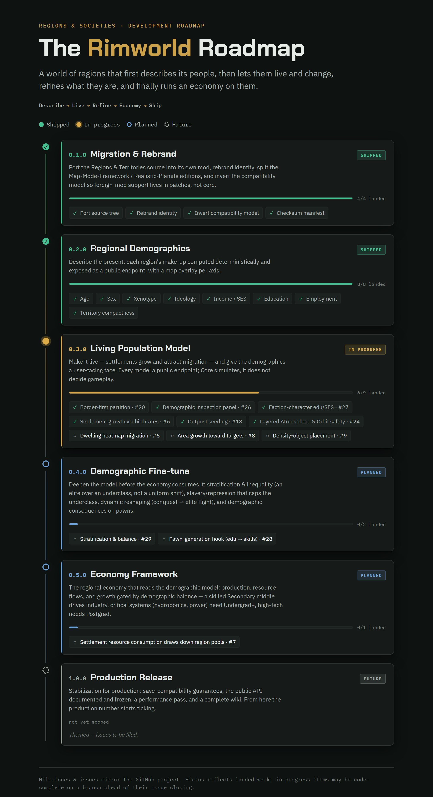

# Regions and Societies (Core, Realistic Planets 2 edition)
A comprehensive layer for creating world population and resource calculations

This is the **Realistic Planets 2 edition** — a fork of
[Core-MMF](https://github.com/Regions-and-societies/Core-MMF) that depends on RP2's bundled
map-mode framework instead of the standalone Map Mode Framework. See [FORK.md](FORK.md) for
what diverges and how upstream releases are pulled forward.

## Roadmap

Development tracks upstream [Core-MMF](https://github.com/Regions-and-societies/Core-MMF);
this edition pulls each release forward. Detail lives in the upstream
[issue tracker](https://github.com/Regions-and-societies/Core-MMF/issues) and
[milestones](https://github.com/Regions-and-societies/Core-MMF/milestones).

## Release provenance

Every release ships `Assemblies/CHECKSUMS.sha256`, generated from the final release build
by `harness/release-manifest.ps1` — run after the last compile and before the tag, and
committed on the release branch so the tag carries it. `harness/verify-binaries.ps1`
verifies any copy of the mod (repo or deployed folder) against that manifest and must pass
clean at cut time. Never generate the manifest retroactively: a manifest written from a
dev build is a fabricated record. See issue #4.
